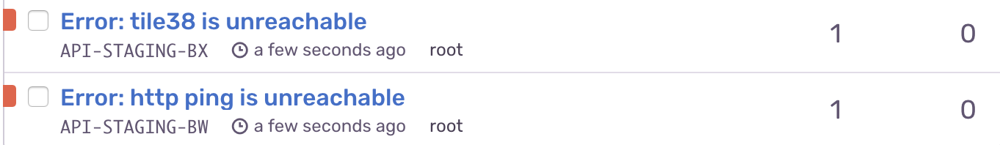

# kubecat
> Minimal network uptime monitor for in-cluster kubernetes and docker cluster services. Also can be run stand-alone for general uptime checks.




Reporting services:
- [Sentry.io](https://sentry.io)

Reporters:
- HTTP `modules.HTTP`
- Tile38 `modules.Tile38`


Example `config.yaml`

```yaml
reporters:
  - name: api-service
    module: "http"
    interval: 60 # time in seconds
    options:
      method: POST
      url: http://localhost:3000/v1/users
      timeout: 30000
      acceptableStatus:
        - 200
        - 201
      headers:
        jwtToken: "jwt token here"

  - name: tile38-object-check
    module: "Tile38"
    interval: 120 # time in seconds
    options:
      url: http://tile38:9851
      timeout: 30 # in seconds
      min: 20 // minimum num_objects in the tile38 database
```

Run:
`SENTRY_DSN=<keyhere> ./kubecat`

In docker:
`docker run -e SENTRY_DSN=<keyhere> -v ${PWD}/config.yaml:/app/config.yaml stevelacy/kubecat`

Kubernetes:

```yaml
apiVersion: v1
kind: ConfigMap
metadata:
  name: kubecat-config
data:
  kubecat-config.yaml: |
    reporters:
      - name: tile38
        module: "Tile38"
        interval: 60 # time in seconds
        options:
          url: http://tile38-read:9851
          timeout: 30 # in seconds
          min: 20

---

kind: ConfigMap
metadata:
  creationTimestamp: 2018-06-07T13:40:27Z
  name: kubecat-config
apiVersion: extensions/v1beta1
kind: Deployment
metadata:
  name: kubecat
spec:
  template:
    metadata:
      labels:
        app: kubecat
    spec:
      containers:
        - image: "stevelacy/kubecat:latest"
          name: kubecat-container
          volumeMounts:
            - name: kubecat-config
              mountPath: /app/config.yaml
              subPath: config.yaml
      volumes:
      - name: kubecat-config
        configMap:
          name: kubecat-config
          items:
            - key: kubecat-config.yaml
              path: config.yaml
```


### [MIT](./LICENSE)
